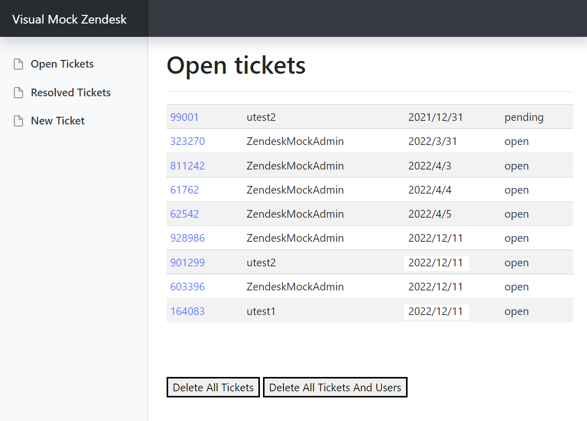
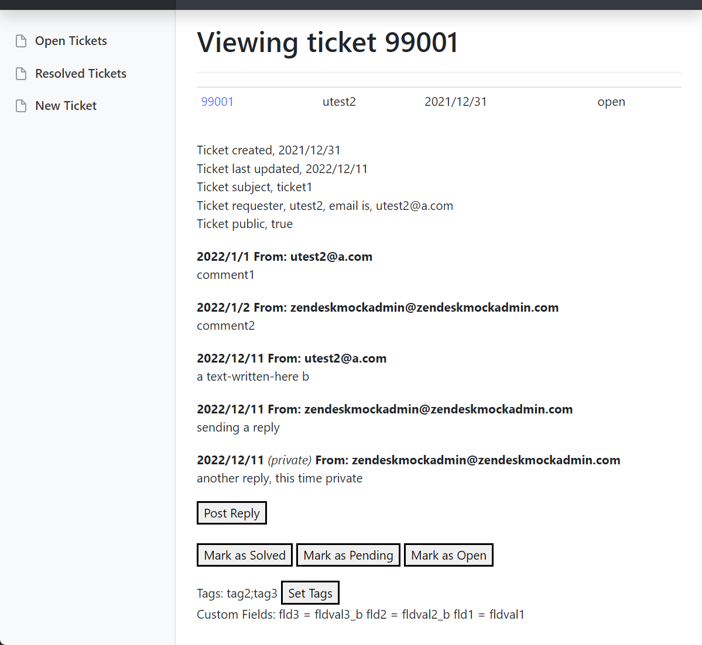
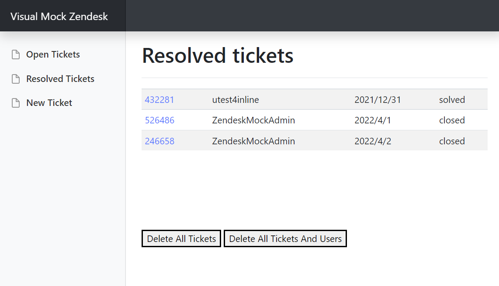

## Description

Do you have an application that interacts with the Zendesk Tickets API? This is a mock implementation of some common API calls that can be used for your nonprod testing. Point your application at this mock instead, especially for local development (even if you have a real nonprod Zendesk instance, it's a central instance that will get cluttered, and will run into rate-limits).

There's a visual UI,

<picture></picture>

<picture></picture>

<picture></picture>

## Setup

```
cd path/to/visual-mock-zendesk-api/src
npm install
npm start

(you can now go to a web browser, navigate to http://localhost:8999/ and see the page)
(now run this to create a ticket,)

curl -d '{"tickets":[{"subject": "subject one", "comments":[{"body": "test one"}]}]}' -H "Content-Type: application/json" -X POST http://localhost:8999/api/v2/imports/tickets/create_many

(you can now refresh http://localhost:8999/ and see the new ticket,)
(click the blue link to edit the ticket and add a reply)

```

## Features

* From the web ui,
    * See the tickets, comments, times, status, requester, etc.
    * See custom fields
    * Add a reply
    * Set ticket status
    * Set ticket tags
* From the api,
    * Create users (`/api/v2/users/create_many`)
    * List user information (`/api/v2/users/show_many`)
    * Search user by email (`/api/v2/users/search`)
    * Ticket retrieval (`/api/v2/users/show_many`)
    * Ticket update (`/api/v2/tickets/update_many`)
    * Ticket creation (`/api/v2/imports/tickets/create_many`)
    * Comments (`/api/v2/tickets/:id/comments`)
    * Statuses for batch calls (`/api/v2/job_statuses/:id`)
    * Searching tickets (`/api/v2/search`)
    * Ticket Tags
    * Custom Fields
    * Triggers

## More information

[Curl examples](src/docs/curl_examples.md)

[Differences, not yet implemented](src/docs/differences_and_not_yet_implemented.md)

[Running visual-mock-zendesk-api's internal tests](src/docs/running_tests.md)

Zendesk is a trademark of Zendesk, Inc.

